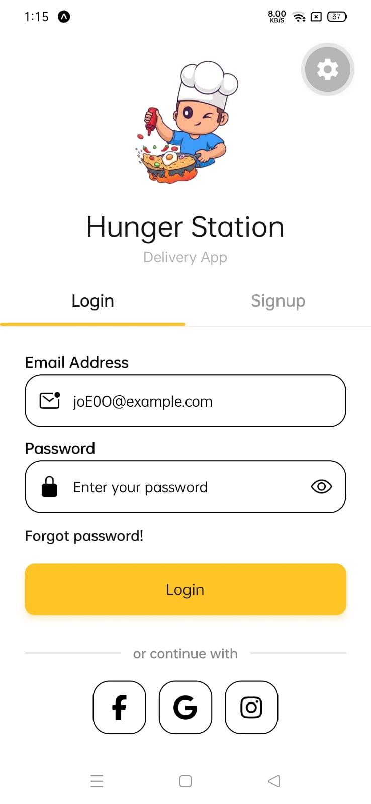
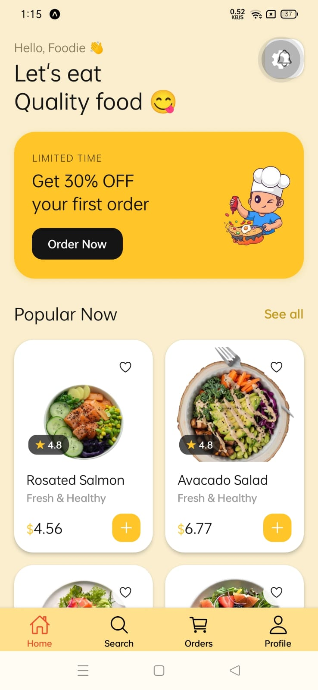
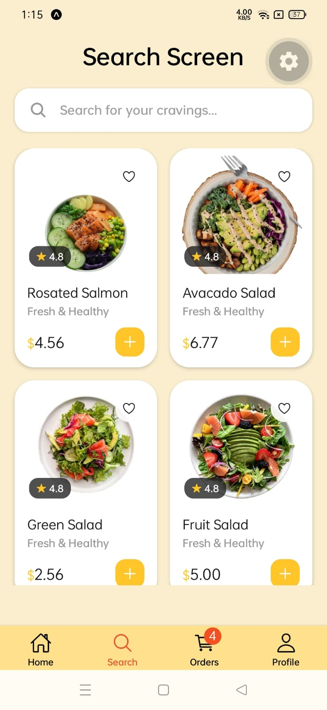
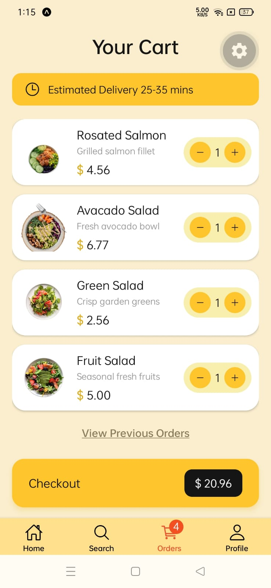

# 🍔 Orix Food — Food Delivery App

A minimal, modern food delivery app built with **Expo** and **React Native**.

## 📱 Screens

| Login | Home | Food Details |
| :---: | :---: | :---: |
|  |  |  |

| Search | Cart |
| :---: | :---: |
|  |  |

## ✨ Features

- **Onboarding** — Get Started screen with Login / Signup (material top tabs)
- **Home** — Promo banner and a responsive food grid (2 columns on phone, 3 on tablet)
- **Food Details** — Full-screen view with quantity selector and add to cart
- **Cart** — In-memory cart with quantity steppers and an order summary
- **Profile** — Minimal profile with menu and logout
- Live cart badge on the bottom tab bar

## 🛠 Tech Stack

- [Expo](https://expo.dev/) SDK 56 · React Native 0.85
- [React Navigation](https://reactnavigation.org/) — native stack, bottom tabs, material top tabs
- TypeScript
- React Context for cart state

## 🚀 Getting Started

```bash
# Install dependencies
bun install

# Start the development server
npx expo start
```

Then scan the QR code with **Expo Go**, or press `a` / `i` to open the Android / iOS emulator.

## 📂 Project Structure

```
src/
├── components/      # Reusable UI (FoodItemsList)
├── context/         # CartContext (in-memory cart)
├── navigators/      # Stack & tab navigators
├── screens/         # Onboarding & main screens
└── assets/          # Images
```
